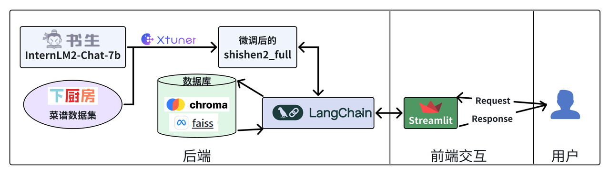
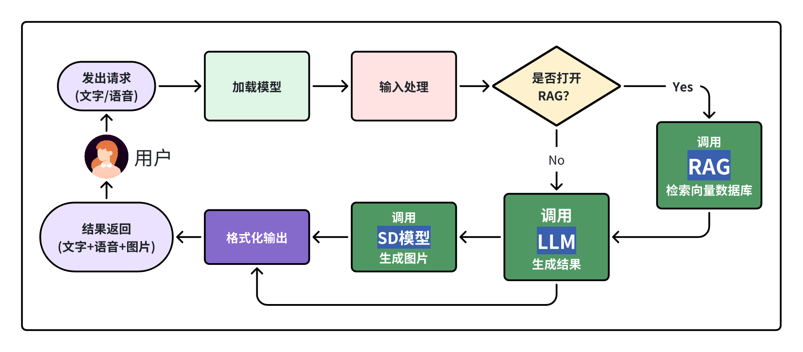
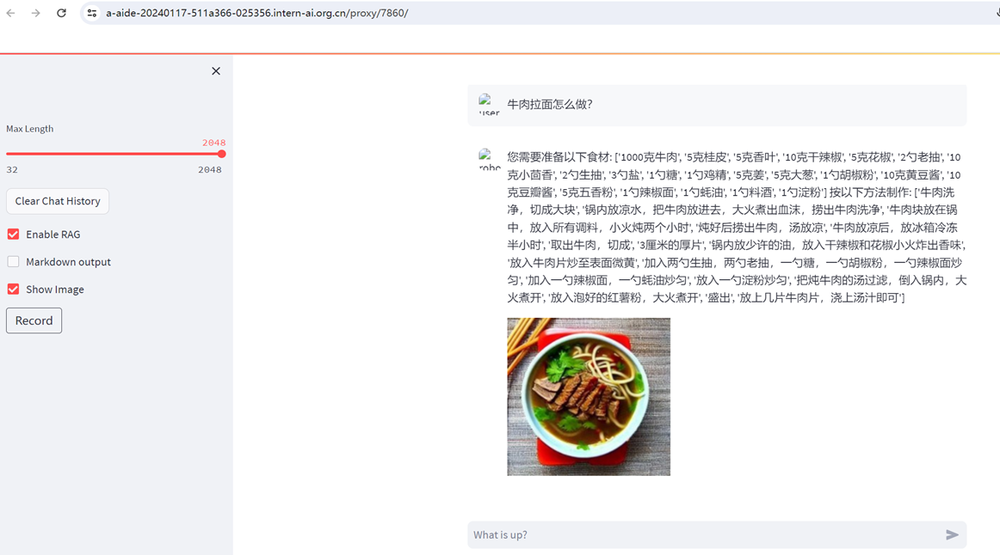
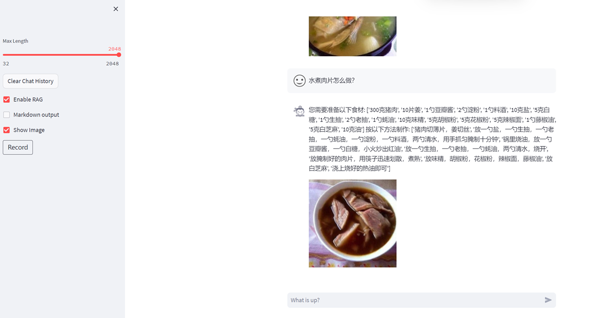
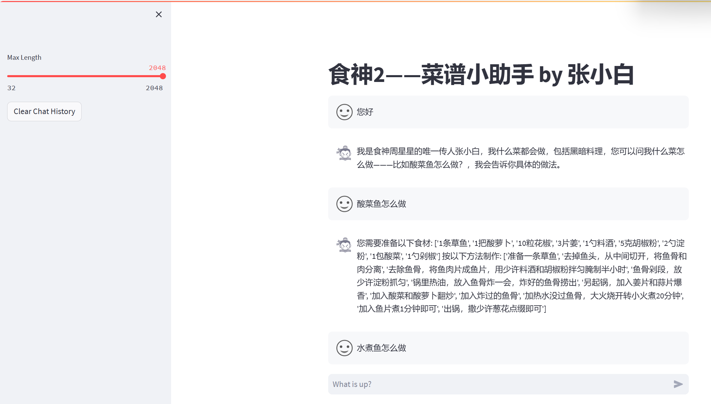
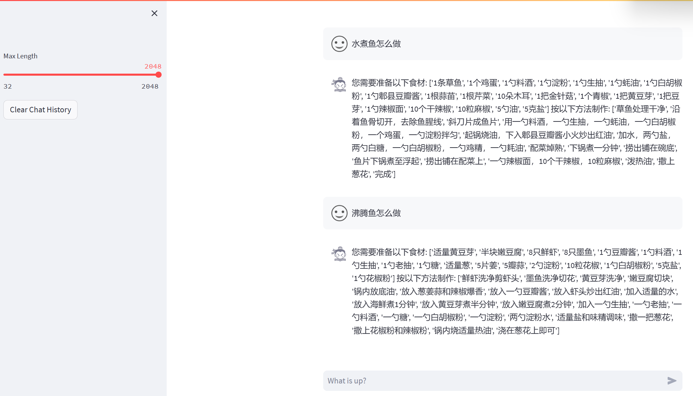

<div align="center">
  
  <br /><br />

[中文](https://github.com/SmartFlowAI/TheGodOfCookery/blob/main/README.md) | [English](https://github.com/SmartFlowAI/TheGodOfCookery/blob/main/README_EN.md)

  [](https://github.com/SmartFlowAI/TheGodOfCookery/issues)   [](https://github.com/SmartFlowAI/TheGodOfCookery/issues)

🔍 Explore our models:

[](https://openxlab.org.cn/models/detail/zhanghui-china/zhangxiaobai_shishen_full)[](https://openxlab.org.cn/models/detail/zhanghui-china/zhangxiaobai_shishen2_full)

[](https://www.modelscope.cn/models/zhanghuiATchina/zhangxiaobai_shishen_full/summary)[](https://www.modelscope.cn/models/zhanghuiATchina/zhangxiaobai_shishen2_full/summary)[](https://www.modelscope.cn/models/zhanghuiATchina/zhangxiaobai_shishen2_full_1_8b/summary)

</div>

## 📍Table of Contents
- [📍Table of Contents](#table-of-contents)
- [📖 Project Introduction](#-project-introduction)
- [🗺️ Technical Architecture](#️-technical-architecture)
  - [1. Overall Technical Architecture](#1-overall-technical-architecture)
  - [2. Application Workflow](#2-application-workflow)
- [✨ Technical Report](#-technical-report)
- [📆 Update Notes](#-update-notes)
- [🛠️ Usage Guide](#️-usage-guide)
  - [1. Data Set Preparation](#1-data-set-preparation)
  - [2. Installation](#2-installation)
  - [3. Training](#3-training)
  - [4. Dialogue](#4-dialogue)
  - [5. Demonstration](#5-demonstration)
  - [6. Model Addresses](#6-model-addresses)
  - [7. Practice Documentation](#7-practice-documentation)
  - [8. Demo Video](#8-demo-video)
- [📋 Project Code Structure](#-project-code-structure)
- [☕ Project Members (listed in no particular order)](#-project-members-listed-in-no-particular-order)
- [💖 Special Thanks](#-special-thanks)
- [References](#references)
- [License](#license)
- [Star History](#star-history)


## 📖 Project Introduction
​	This project, named "The God of Cookery," is inspired by the renowned movie of the same name starring the comedic master, Stephen Chow. The project's goal is to provide cooking advice and recipe recommendations through artificial intelligence technology, helping users to enhance their cooking skills and reduce the barriers to cooking, thereby realizing the movie's message: "With heart, anyone can become a god of cookery."
​	The core concept of this application is based on the InternLM dialogue model, which has been fine-tuned using the XiaChuFang Recipe Corpus, consisting of 1,520,327 Chinese recipes. The model is hosted on [ModelScope](https://www.modelscope.cn/models/zhanghuiATchina/zhangxiaobai_shishen2_full/summary), and the application is deployed on [OpenXLab](https://openxlab.org.cn/apps/detail/zhanghui-china/shishen2024). Special thanks to the Moda Community for providing free space for model hosting and to OpenXLab for offering the deployment environment and GPU resources.
​	Please note that the answers provided by this application are intended for reference only and should not be considered as actual steps for recipe preparation. Due to the "hallucination" characteristics of large-scale models, some recipes might cause psychological or physiological effects. Users are advised not to take these recipes out of context.

## 🗺️ Technical Architecture

### 1. Overall Technical Architecture

The project primarily relies on the open-source model from the Shanghai AI Lab, known as internlm-chat-7b, which includes both first and second generations. We fine-tuned this model on the XiaChuFang Recipe Corpus, which consists of 1,520,327 Chinese recipes. This tuning was facilitated by Xtuner with LoRA fine-tuning, resulting in the creation of the shishen2_full model. Post-tuning, the model was integrated with a vector database into Langchain, achieving an enhanced retrieval effect through RAG (Retrieval-Augmented Generation). It supports multimodal (voice, text, image) question-answering dialogues. The frontend interaction with users is implemented using Streamlit.



### 2. Application Workflow

Upon receiving a request from a user, the application loads the models (voice model, text-to-image model, fine-tuned dialogue model) and processes the user's text or voice input. If the RAG switch is not activated, it directly calls the fine-tuned dialogue model to generate a reply, formats the result, and uses the stable diffusion model to generate an image, finally returning the result to the user. If the RAG switch is activated, it uses Langchain to search the vector database, inputs the search results into the fine-tuned dialogue model to generate a reply, formats the result, and calls the stable diffusion model to generate an image, ultimately returning the result to the user.



## ✨ Technical Report

Access the technical report and explanatory videos through the following links:

[**1. Technical Report**](https://github.com/SmartFlowAI/TheGodOfCookery/blob/main/docs/zh_cn/tech_report.md)

[**2. Explanatory Video**](https://www.bilibili.com/video/BV1kr421W7iA)

| **Section Name**      | **Document Author**        | **Technical Lead**     |
| --------------------- | -------------------------- |------------------------|
| **General Overview**  | Xuanyuan, Jiuyue, Zhanghui | Zhanghui               |
| **Voice Recognition** | Xuanyuan                   | sole fish              |
| **Text-to-Image**     | Fang Yuliang               | Fang Yuliang           |
| **RAG**               | Xuanyuan                   | Charles, Yue Zhengmeng |
| **Model Fine-Tuning** | Xuanyuan                   | Wang Weilong, Xuanyuan |
| **Web UI**            | Fang Yuliang               | Fang Yuliang           |

## 📆 Update Notes
- [2024.5.1] Data cleaning experiment preliminarily completed
- [2024.4.18] New RAG module based on llama-index Minimum Viable Product (MVP) released
- [2024.3.20] Updated README
- [2024.3.19] Integrated documentation into the docs directory
- [2024.3.9] Based on the RAG module (faiss) by team member @Yue Zhengmeng, integrated the text2image branch, released the fourth phase of the second-generation application based on OpenXLab A100 [openxlab A100 app](https://openxlab.org.cn/apps/detail/zhanghui-china/shishen2024) and OpenXLab A10 application [openxlab A10 app](https://openxlab.org.cn/apps/detail/zhanghui-china/shishen2024_1.8b)
- [2024.3.4] Added English README
- [2024.3.3] Based on the paraformer voice input module by team member @solo fish, integrated the text2image branch, released the third phase of the second-generation application based on OpenXLab A100 [openxlab app](https://openxlab.org.cn/apps/detail/zhanghui-china/nlp_shishen3)
- [2024.2.24] Based on the RAG module (Chroma) by team member @Charles, integrated the text2image branch, released the second phase of the second-generation application based on OpenXLab A100 [openxlab app](https://openxlab.org.cn/apps/detail/zhanghui-china/nlp_shishen3)
- [2024.2.22] Based on the text-to-image module by team member @Fang Shengliang and the whisper voice input module by @solo fish, integrated the text2image branch, released the first phase of the second-generation application based on OpenXLab A100 [openxlab app](https://openxlab.org.cn/apps/detail/zhanghui-china/nlp_shishen3)
- [2024.1.30] Released the model and APP based on the second-generation 1.5 million recipe fine-tuning (Using InternStudio+A100 1/4X2 40G memory for fine-tuning, from 1.25 15:46 to 1.30 12:25, fine-tuning duration was 4 days 20 hours 39 minutes)
- [2024.1.28] Released the model and APP based on the first-generation 1.5 million recipe fine-tuning (Using WSL+Ubuntu22.04+RTX4090 24G memory for fine-tuning, from 1.26 18:40 to 1.28 13:46, fine-tuning duration was 1 day 19 hours 6 minutes).

## 🛠️ Usage Guide

### 1. Data Set Preparation

Download the 1.5 million XiaChuFang fine-tuning dataset: [Download Link (password: 8489)](https://pan.baidu.com/s/1TyqDWRI5jOs621VXr-uMoQ)

### 2. Installation

- Set up a Python virtual environment:

```bash
conda create -n cook python=3.10 -y
conda activate cook
```

- Clone the repository:

```
git clone https://github.com/SmartFlowAI/TheGodOfCookery.git
cd ./TheGodOfCookery
```

- Install PyTorch and other dependencies:

```
conda install pytorch torchvision torchaudio pytorch-cuda=12.1 -c pytorch -c nvidia
pip install -r requirements.txt
```

Note: Choose the CUDA version according to your own CUDA installation, typically 11.8 or 12.1.

### 3. Training

- Train the first-generation 7b model using xtuner 0.1.9, fine-tune on internlm-chat-7b.
- Train the second-generation 7b model using xtuner 0.1.13, fine-tune on internlm2-chat-7b.
- Train the second-generation 1.8b model using xtuner 0.1.15.dev0, fine-tune on internlm2-chat-1.8b.

Fine-tuning method:

```
xtuner train ${YOUR_CONFIG} --deepspeed deepspeed_zero2
```

`--deepspeed` indicates using [DeepSpeed](https://github.com/microsoft/DeepSpeed) to optimize the training process. XTuner integrates several strategies, including ZeRO-1, ZeRO-2, and ZeRO-3. If you wish to disable this feature, simply remove this parameter.

Convert the saved `.pth` model (if using DeepSpeed, this will be a directory) into a LoRA model:

```
export MKL_SERVICE_FORCE_INTEL=1
xtuner convert pth_to_hf ${YOUR_CONFIG} ${PTH} ${LoRA_PATH}
```

Merge the LoRA model into the HuggingFace model:

```
xtuner convert merge ${Base_PATH} ${LoRA_PATH} ${SAVE_PATH}
```

### 4. Dialogue

```
xtuner chat ${SAVE_PATH} [optional arguments]
```

Arguments:

- `--prompt-template`: Use 'internlm_chat' for the first-generation model and 'internlm2_chat' for the second-generation model.
- `--system`: Specify the dialogue system identifier.
- `--bits {4,8,None}`: Specify the LLM's bit rate. Default is fp16.
- `--no-streamer`: If you want to remove the streamer.
- `--top`: For second-generation models, a recommendation of 0.8.
- `--temperature`: For second-generation models, a recommendation of 0.8.
- `--repetition-penalty`: For the second-generation 7b model, recommended 1.002; for the 1.8b model, recommended 1.17; for the first-generation model, no need to specify.
- For more information, execute `xtuner chat -h` to view.

### 5. Demonstration

Two-phase dialogue effects (text + image dialogue):

Demo access addresses: [A100](https://openxlab.org.cn/apps/detail/zhanghui-china/shishen2024) [A10](https://openxlab.org.cn/apps/detail/zhanghui-china/shishen2024_1.8b)





First-phase dialogue effects (text-only dialogue):

Demo examples





### 6. Model Addresses

- [ModelScope First-Generation 7b Model](https://www.modelscope.cn/models/zhanghuiATchina/zhangxiaobai_shishen_full/summary)
- [ModelScope Second-Generation 7b Model](https://www.modelscope.cn/models/zhanghuiATchina/zhangxiaobai_shishen2_full/summary)
- [ModelScope Second-Generation 1.8b Model](https://www.modelscope.cn/models/zhanghuiATchina/zhangxiaobai_shishen2_full_1_8b/summary)
- [OpenXLab First-Generation 7b Model](https://openxlab.org.cn/models/detail/zhanghui-china/zhangxiaobai_shishen_full)
- [OpenXLab Second-Generation 7b Model](https://openxlab.org.cn/models/detail/zhanghui-china/zhangxiaobai_shishen2_full)

Example code for model interaction:

```shell
import torch
from modelscope import AutoTokenizer, AutoModelForCausalLM
from tools.transformers.interface import GenerationConfig, generate_interactive

# Relative path on ModelScope, for example, the path for the second-generation fine-tuned model would be zhanghuiATchina/zhangxiaobai_shishen2_full

tokenizer = AutoTokenizer.from_pretrained(model_name_or_path, trust_remote_code=True)
model = AutoModelForCausalLM.from_pretrained(model_name_or_path, trust_remote_code=True, torch_dtype=torch.bfloat16, device_map='auto')
model = model.eval()

messages = []
generation_config = GenerationConfig(max_length=max_length, top_p=0.8, temperature=0.8, repetition_penalty=1.002)

response, history = model.chat(tokenizer, "Hello", history=[])
print(response)
response, history = model.chat(tokenizer, "How to make sour and spicy fish", history=history)
print(response)
```

### 7. Practice Documentation

- [First-Generation Phase One Practice](https://zhuanlan.zhihu.com/p/678019309)
- [Second-Generation Phase One Practice](https://zhuanlan.zhihu.com/p/678376843)

### 8. Demo Video

- [Phase One Practice Video](https://www.bilibili.com/video/BV1Ut421W7Qg)
- [Competition Video](https://www.bilibili.com/video/BV1u6421F7Zw)

## 📋 Project Code Structure

Second Phase

```shell
Project Directory
|---assets  # Image directory, generated assets are also temporarily stored here, planning to move to other directories in the future
|     |---robot.png                                        # Dialogue robot icon
|     |---user.png                                         # Dialogue user icon
|     |---shishen.png                                      # Project icon (Main contributor: Liu Guanglei)
|
|---config   # Configuration file directory (Main contributor: Fang Yuliang)
|     |---__init__.py                                      # Initialization script
|     |---config.py                                        # Configuration script
|
|---data_cleaning   # Data cleaning directory (Main contributor: Yue Zhengmeng and Charles)
|     |---convert_origin_data_to_juicer_input.py           #Script to convert the original dataset into Data Juicer input format
|     |---convert_juicer_output_to_xtuner_data.py          #Script to convert Data Juicer output to xtuner format dataset 
|     |---config.yaml data                                 #Data Juicer config file  
|     |---results_analyse.ipynb                            #Jupyter notebook for further analysis of Data Juicer data analysis result
|
|---docs   # Documentation directory
|     |---tech_report.md                                   # Technical report
|     |---Introduce_x.x.pdf                                # Project introduction PPT
|
|---eval   # RAG module evaluation directory
|
|---food_icon          # Ingredient icon directory
|     |---*.png                                            # Icons for various ingredients
|
|---gen_image    # Text-to-Image directory (Main contributor: Fang Yuliang)
|     |---__init__.py                                      # Initialization script
|     |---sd_gen_image.py                                  # Text-to-Image module using Stable Diffusion
|     |---zhipu_ai_image.py                                # Text-to-Image module using Zhipu AI
|
|---images   # Cache images generated by the text-to-image model
|
|---rag_langchain   # RAG code directory based on langchain (Main contributor: Yue Zhengmeng and Charles)
|     |---CookMasterLLM.py                                 # LLM packaged by langchain
|     |---create_db_json.py                                # Create vector database script
|     |---HyQEContextualCompressionRetriever.py            # HyQE retriever
|     |---interface.py                                     # RAG module interface
|     |---README.md                                        # RAG module description
|
|---rag_llama   # RAG code directory based on llama-index (Main contributor: Yue Zhengmeng)
|     |---create_db_json.py                                # Create vector database script
|     |---HyQEFusionRerankRetriever.py                     # HyQE retriever
|     |---interface.py                                     # RAG module interface
|     |---README.md                                        # RAG module description
|
|---speech    # Paraformer voice recognition directory (Main contributor: solo fish)
|     |---__init__.py                                      # Initialization script
|     |---utils.py                                         # Voice recognition processing script
|
|---app.py                                                 # Web Demo main script
|---cli_demo.py                                            # Model testing script
|---convert_t2s.py                                         # Traditional to Simplified Chinese conversion tool (Main contributor: Bin Bin)
|---download.py                                            # Model download script
|---parse_cur_response.py                                  # Output formatting tool (Main contributor: Bin Bin)
|---start.py                                               # streamlit start script
|---web_demo.py                                            # Web Demo start script
|---requirements.txt                                       # System dependency packages (please use pip install -r requirements.txt for installation)
|---README.md                                              # This document
```

## ☕ Project Members (listed in no particular order)

|                             Name                             |                         Organization                         |                         Contribution                         |                           Remarks                            |
|:------------------------------------------------------------:| :----------------------------------------------------------: | :----------------------------------------------------------: | :----------------------------------------------------------: |
| [Zhang Xiaobai](https://www.zhihu.com/people/zhanghui_china) | Graduated from Nanjing University, Data Engineer at a company |      Project planning, testing, and miscellaneous tasks      | Huawei Cloud HCDE (formerly Huawei Cloud MVP), Top 10 Huawei Cloud Community Bloggers in 2020, Outstanding Ascend Community Developer in 2022, Outstanding Huawei Cloud Community Moderator in 2022, MindSpore Evangelist, Excellent DataWhale Learner |
|          [sole fish](https://github.com/YanxingLiu)          | PhD student at the University of Chinese Academy of Sciences |                      Voice input module                      |                                                              |
|         [Charles](https://github.com/SchweitzerGAO)          | Bachelor's degree from Tongji University, currently applying for master's |    RAG module (based on Chroma) for the first generation     |                                                              |
|       [Yue Zhengmeng](https://github.com/YueZhengMeng)       | Bachelor's degree from Shanghai Ocean University, currently applying for master's | RAG module (based on faiss & Chroma) for the second generation |                                                              |
|          [Bin Bin](https://github.com/Everfighting)          | Bachelor's degree from East China Normal University, Algorithm Developer at a company |                      Formatting output                       |                                                              |
|         [Fang Yuliang](https://github.com/leonfrank)         | Graduated from Nanjing University, Algorithm Engineer at a company |          Text-to-Image module, configuration tools           |                                                              |
|        [Liu Guanglei](https://github.com/Mrguanglei)         |                              -                               |              Icon design, frontend optimization              |                                                              |
|         [Miao Miao Mi](https://github.com/miyc1996)          | Master's degree from Beijing University of Aeronautics and Astronautics, Engineer at a state-owned enterprise in Shanghai | Dataset preparation, subsequent local model deployment testing |                                                              |
|                         Wang Weilong                         |                              -                               |                  Dataset, model fine-tuning                  |                                                              |
|            [Xuanyuan](https://github.com/zzd2001)            |            Master's student at Nanjing University            |       Document preparation, dataset, model fine-tuning       |                                                              |

## 💖 Special Thanks

<p align="center"><b>We would like to extend our gratitude to the Shanghai Artificial Intelligence Laboratory for organizing the Shusheng·Puyu Practical Camp event~~~</b></p>

<div align=center></div>

<p align="center"><b>We are deeply grateful for the computational support provided by OpenXLab for project deployment~~~</b></p>

<div align=center></div>

<p align="center"><b>A heartfelt thank you to Puyu Assistant for their support of the project~~~</b></p>

<div align=center></div>

## References

- The package and call logic of the RAG module in this project refers to [EmoLLM Project](https://github.com/SmartFlowAI/EmoLLM), herewith acknowledge with thanks.

## License

This project is licensed under the [Apache License 2.0](LICENSE).

## Star History

[](
